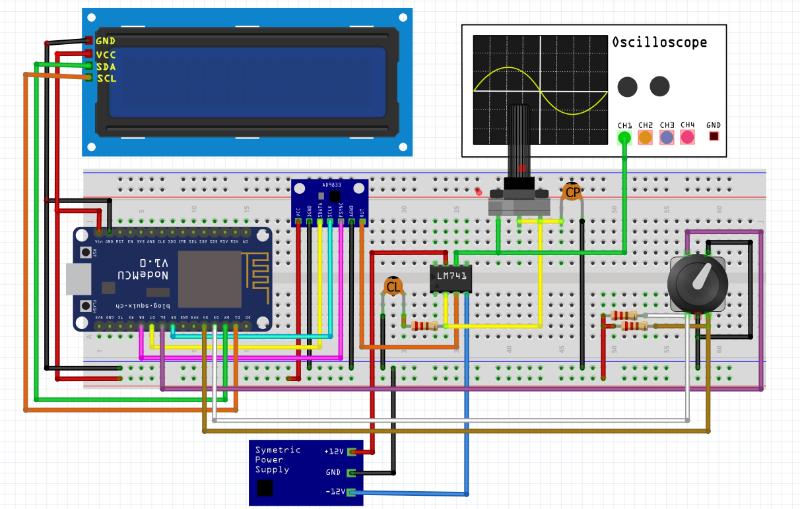

# AD9833-Function-Generator-NodeMCU
Membuat DDS Function / Signal Generator (DIY) menggunakan AD9833 dan NodeMCU

### Wiring Diagram

### Library 
- [LCD 16x2 I2C Library](https://github.com/johnrickman/LiquidCrystal_I2C)
- [AD9833 Library](https://github.com/RobTillaart/AD9833)